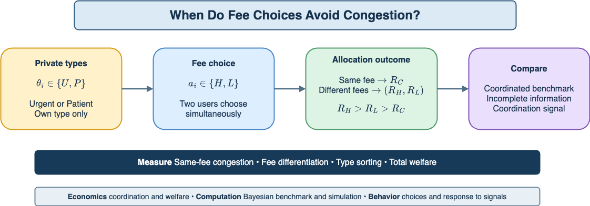

# Strategic Fee-Level Choice under Incomplete Information

**An anti-coordination game on Algorand**

[](https://colab.research.google.com/drive/1Ox65uxV-g7nPSgpChWZFGmYOfYQTQoCi?usp=sharing)
[](https://huggingface.co/spaces/dku-comsci-econ206-2026/SubmitOrWait)



## Research question

Can two users with privately known transaction urgency avoid same-fee congestion, and can a nonbinding coordination signal improve fee differentiation and welfare?

Two users simultaneously choose a **High fee (H)** or **Low fee (L)** after privately observing whether their transaction is **Urgent (U)** or **Patient (P)**.

- Same fee, `(H,H)` or `(L,L)`: both users receive the congestion payoff `R_C`.
- Different fees, `(H,L)` or `(L,H)`: the H user receives `R_H`; the L user receives `R_L`.
- Baseline ordering: `R_H > R_L > R_C`.

The project compares:

1. a coordinated complete-information benchmark;
2. decentralized choice under incomplete information; and
3. incomplete information plus a nonbinding coordination signal.

Primary outcomes are same-fee congestion, successful fee differentiation, efficient type sorting, individual payoff, total welfare, and distance from the planner benchmark.

## Baseline calibration

| Type | `R_H` | `R_L` | `R_C` |
|---|---:|---:|---:|
| Urgent | 8 | 2 | 1 |
| Patient | 5 | 4 | 1 |

The baseline common prior is `Pr(Urgent) = 0.60`. Under these illustrative parameters, one pure Bayesian equilibrium is:

```text
Urgent -> H
Patient -> L
```

These values are experimental inputs, not measured Algorand protocol parameters.

## Repository structure

```text
.
├── assets/
│   └── fee_choice_teaser.png
├── docs/
│   ├── COLAB.md
│   ├── EVIDENCE_STATUS.md
│   ├── HUGGING_FACE.md
│   └── REPRODUCIBILITY.md
├── notebooks/
│   ├── Algorand_PS2_Fee_Choice_Game.ipynb
│   └── Algorand_PS2_Fee_Choice_Game.executed.ipynb
├── paper/
│   ├── Strategic_Fee_Level_Choice_Proposal.pdf
│   └── overleaf/
├── scripts/
│   ├── build_fee_choice_notebook.py
│   └── validate_notebooks.py
├── CITATION.cff
├── LICENSE
└── requirements.txt
```

## Run the notebook

### Google Colab

Open the badge above and choose **Runtime -> Run all**.

### Local execution

```bash
python -m venv .venv
source .venv/bin/activate
pip install -r requirements.txt
jupyter lab notebooks/Algorand_PS2_Fee_Choice_Game.ipynb
```

To create a fresh executed notebook:

```bash
jupyter nbconvert \
  --to notebook \
  --execute notebooks/Algorand_PS2_Fee_Choice_Game.ipynb \
  --output Algorand_PS2_Fee_Choice_Game.executed.ipynb \
  --output-dir notebooks \
  --ExecutePreprocessor.timeout=600
```

To regenerate the clean source notebook from the repository script:

```bash
python scripts/build_fee_choice_notebook.py
```

## Interactive behavioral artifact

The [Fee Coordination Game](https://huggingface.co/spaces/dku-comsci-econ206-2026/SubmitOrWait) implements eight independent one-shot rounds. It elicits the participant's fee choice, belief about the other user's H choice, confidence, and short reason. The signal condition displays a nonbinding differentiated recommendation. See [docs/HUGGING_FACE.md](docs/HUGGING_FACE.md).

## Evidence status

The repository contains a formal game, computational implementation, fresh-run **simulated** outputs, an interactive behavioral interface, proposal PDF, and Overleaf source. It does not contain participant observations or evidence about current Algorand network performance.

The following remain unverified or pending:

- Algorand fee mapping, congestion/confirmation rule, and capacity calibration;
- empirical payoff calibration and type distribution;
- power analysis, sample size, ethics decisions, and preregistration;
- laboratory choices, payments, utilities, revenues, and treatment effects;
- peer, instructor, discussant, and post-symposium feedback; and
- an A0 poster artifact and link.

See [docs/EVIDENCE_STATUS.md](docs/EVIDENCE_STATUS.md) before citing results.

## Authors and course

- Lin Zhang — `lin.zhang@dukekunshan.edu.cn`
- Zijie Wang — `zijie.wang@dukekunshan.edu.cn`
- COMSCI/ECON 206: Computational Microeconomics
- Instructor: Professor Luyao Zhang
- Team 7, Symposium Session A

## License

Original project code and documentation are released under the MIT License. Third-party ACM class and bibliography files in `paper/overleaf/` retain their upstream terms.
